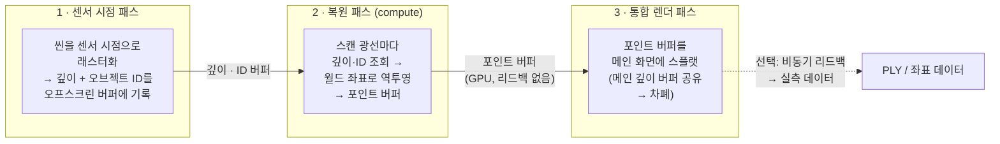

# LiDAR-mimic

[English](README.md) · **한국어**

🔗 **라이브 데모:** [wonhotoss.github.io/LiDAR-mimic](https://wonhotoss.github.io/LiDAR-mimic/) — WebGPU 지원 브라우저(최신 Chrome/Edge) 필요.

일반 3D 렌더러로부터 **LiDAR 포인트클라우드 특유의 시각 연출**을 끌어내기 위한 프로그램 구조 제안.

핵심 아이디어는 간단하다. 포인트클라우드를 얻기 위해 실제로 광선을 하나씩 추적(raycast)하지 않는다.
대신 **센서 시점에서 씬을 한 번 래스터화**하고, 그 결과(깊이 버퍼)를 스캔 패턴의 각 광선이 그대로 읽어
포인트를 복원한다. 복원과 렌더링은 모두 GPU 안에서 일어나며 CPU로의 리드백이 없다.

이 문서는 플랫폼에 의존하지 않는다. 특정 엔진/API 용어 대신 렌더 파이프라인 용어로 동작을 기술한다.
Unity 구현과 사용법은 [unity/README.ko.md](unity/README.ko.md)를 참고하라.

이 프로젝트는 실제 프로덕션 환경에서의 시각 연출을 위해 작성되었으므로, 널리 쓰이는 플랫폼들에서의
아이디어 적용과 라이브 데모를 포함해 실용성을 입증한다.

---

## 무엇을 하려는가

- 3D 씬(메시, 스킨드 메시, 애니메이션 오브젝트로 이루어진 일반적인 씬)을 입력으로 받는다.
- 센서(=LiDAR)의 위치·방향·조사(scan) 패턴에 따라, 씬 표면에 광선이 맺히는 지점들을 포인트로 얻는다.
- 그 포인트들을 메인 화면 위에, 실제 LiDAR 스캔처럼 보이는 방식으로 렌더링한다.
- 위 전 과정을 실시간 수준(고밀도 포인트 · 고해상도 · 대화형 fps)으로 유지한다.

즉 "실제 포인트클라우드 데이터를 만드는 것"이 1차 목표가 아니라, **포인트클라우드처럼 보이는 시각 연출**이
1차 목표다. 다만 필요하면 같은 파이프라인에서 실제 좌표 데이터를 뽑아낼 수도 있다(아래 *리드백* 참조).

---

## 왜 raycast 대신 래스터인가

먼저 용어. 이 방식을 흔히 "빠른 raycast"라고 부르고 싶어지지만, 엄밀히는 raycast가 아니다.
광선을 씬 지오메트리와 교차시키는(traversal) 대신, **센서 시점의 래스터라이즈 결과를 스캔 광선이 조회**한다.
결과물(광선이 표면과 만나는 지점)은 raycast와 동일하지만, 그것을 얻는 경로가 다르다.
학계·업계에서는 이 접근을 보통 **"raster-based LiDAR (simulation)" / "rasterization-based LiDAR"**,
또는 **"reverse rasterization" · "depth-buffer LiDAR"**라고 부른다. (내부 코드네임으로는
deferred shading과의 구조적 유사성 때문에 *"deferred raycasting"*이라고도 하지만, 이는 확립된 용어가
아니다.) 관련 선행 연구는 아래 [선행 연구 / 관련 사례](#선행-연구--관련-사례)를 참고하라.

두 방식의 비용 구조가 근본적으로 다르다.

| | 실제 raycast (BVH 등) | 래스터 기반 스캔 (이 프로젝트) |
|---|---|---|
| 가시성(occlusion) 해결 | 광선마다 가속구조를 하강 · `O(log P)` | 래스터 패스가 한 번에 해결(하드웨어 depth test), 광선은 결과만 조회 · `O(1)` |
| 스캔 광선 수 증가 | 광선당 traversal 비용이 그대로 누적 | 이미 만들어진 버퍼를 조회하는 비용뿐 — 거의 무료 |
| 본 애니메이션 / 메시 변형 | 프레임마다 가속구조 refit/rebuild 필요 | 정점 셰이더에서 평소처럼 스키닝 — 추가 비용 없음 |
| 유지해야 할 상태 | 씬과 동기화된 가속구조 | 없음 (매 프레임 새로 그림) |

정리하면, 래스터 방식이 이기는 지점은 "병렬성"이 아니다(양쪽 다 병렬화 가능하다).
본질적 이점은 **① 가시성을 한 번만 풀어 모든 광선이 공유**하고, **② 광선당 임계 경로가 `O(1)`**이며,
**③ 고정 기능 래스터라이저/깊이 테스트 하드웨어를 그대로 쓰고**, **④ 애니메이션 하에서도 동기화할
영속 자료구조가 없다**는 것이다.

이 이점은 **광선 수가 많고(고밀도), 오브젝트가 움직이거나 변형되며, 단일 전방 시야로 충분한** 경우에
가장 크게 작동한다. 반대로 광선이 수백 개 수준으로 적거나, 360°/구면 커버리지가 필요하거나,
양자화 없는 물리적 정밀도가 목적이라면 실제 (GPU) raycast가 더 낫다.

---

## 파이프라인 개요

렌더링을 세 개의 논리적 패스로 나눈다.

### 1. 센서 시점 패스 (깊이 선획득)

센서는 곧 하나의 카메라다(위치·방향·FoV를 가짐). 이 시점에서 씬을 오프스크린 버퍼로 래스터화한다.
결과 버퍼에는 픽셀마다 두 값이 기록된다.

- **깊이** — 그 방향에서 가장 가까운 표면까지의 거리(정규화 좌표 깊이).
- **오브젝트 ID** — 그 표면이 어느 오브젝트에서 왔는지.

가장 가까운 표면은 하드웨어 깊이 테스트가 결정한다. 즉 이 한 번의 래스터로 **모든 스캔 광선의 가시성이
동시에 해결된다.** 씬의 모든 opaque 오브젝트를 그려 넣으므로, 포인트가 되지 않을 오브젝트도
차폐물(occluder) 역할을 한다.

### 2. 복원 패스 (GPU compute)

스캔 패턴은 "센서에서 나가는 광선들"의 집합이며, 센서 프로젝션 공간의 2D 좌표(정규화 XY) 배열로 표현된다.
compute 패스는 광선마다:

1. 광선의 프로젝션 XY를 오프스크린 버퍼의 텍셀 좌표로 바꿔 **깊이와 ID를 조회**한다(보간 없는 point 샘플 — 실루엣 오염 방지).
2. (XY, 조회한 깊이)를 역-뷰프로젝션으로 **월드 좌표로 역투영**한다.
3. `{ 월드 좌표, 오브젝트 ID }`를 **포인트 버퍼**에 기록한다.

이 결과가 곧 포인트클라우드다. 광선이 아무 표면과도 만나지 않았으면 배경 ID(0)가 남아 이후 자동으로 걸러진다.
이 버퍼는 CPU로 내려오지 않고 GPU에 머문다.

### 3. 통합 렌더 패스

메인 카메라는 먼저 일반 오브젝트를 평소대로 래스터화한다(solid). 이어서 포인트 버퍼를 읽어 각 포인트를
**화면 고정 크기의 사각형 스플랫**으로 그린다. 이때:

- **메인 깊이 버퍼를 공유**한다. 따라서 일반 오브젝트에 의한 포인트 차폐, 포인트끼리의 자기 차폐가
  하드웨어 깊이 테스트로 자연스럽게 처리된다.
- 포인트를 그릴 오브젝트 집합(=포인트클라우드로 표시할 오브젝트의 ID 목록)과 대조해, 목록에 없는 포인트는
  퇴화(degenerate)시켜 폐기한다. 이 판정은 그리는 시점에 이루어지므로 **일반↔포인트 토글이 재계산 없이 즉시** 반영된다.
- 스플랫 색/크기는 오브젝트 ID별로 다르게 주거나(오브젝트별 스타일), 센서로부터의 거리로 컬러맵을
  입힐 수 있다(깊이 컬러맵).

리드백이 없으므로 1·2·3 패스는 매 프레임 다시 돌아도 된다 — 오브젝트 이동과 본 애니메이션이 그대로 반영된다.

---

## 이 구조의 장점

- **씬 복잡도와 사실상 decoupling.** 포인트 생성 비용은 스캔 광선 수와 오프스크린 버퍼 해상도에 좌우되며,
  씬의 폴리곤 수와는 (래스터 자체의 일반적 비용을 빼면) 분리된다. 고밀도 포인트클라우드를 실시간으로 얻는다.
- **리드백 없는 GPU 완결 경로.** 생성부터 렌더까지 GPU 안에서 끝난다. CPU 대역폭·메모리 왕복이 없다.
- **자연스러운 차폐.** 오브젝트 간 차폐와 자기 차폐 모두 깊이 테스트로 처리된다. 일반 렌더 오브젝트와
  포인트 렌더 오브젝트가 한 씬에서 서로를 올바르게 가린다.
- **실시간 조정.** 센서 위치·방향·FoV, 스캔 패턴의 밀도·모양을 런타임에 바꿀 수 있다. 패턴이 바뀌면
  광선 버퍼만 다시 채우면 된다.
- **오브젝트별 차별화.** 어떤 오브젝트를 일반 렌더/포인트 렌더/양쪽으로 할지, 포인트의 색과 크기를
  오브젝트별로 어떻게 줄지 개별 제어할 수 있다.
- **선택적 실측 데이터.** 시각 연출이 목적이지만, 같은 포인트 버퍼를 (비동기·대역 외로) 리드백해
  실제 좌표+ID 데이터로 내보낼 수 있다. 이 경로는 실시간 렌더 경로와 분리되어 있어 fps에 영향을 주지 않는다.

---

## 한계와 성질

- **단일 원근 시야(<180°).** 스캔 광선이 하나의 프로젝션 그리드 위에 놓인다는 것이 `O(1)` 조회의 전제다.
  이 때문에 360°/회전형 LiDAR는 이 구조로 직접 표현할 수 없다(다중 센서 또는 별도 설계 필요).
- **깊이 양자화.** 오프스크린 버퍼 해상도가 광선 밀도에 비해 낮으면 여러 광선이 같은 텍셀을 조회해
  포인트 배치가 계단식으로 양자화된다. 버퍼 해상도를 광선 밀도 이상으로 두면 해소된다.
- **실루엣의 flying pixel.** 오브젝트 경계에서 광선이 앞/뒤 표면 사이에 튀는 포인트가 생길 수 있다.
  실제 LiDAR에도 있는 아티팩트라 오히려 authentic하게 받아들일 수 있다.
- **temporal shimmer.** 광선이 센서 프로젝션 공간에 고정되어 있어, 오브젝트나 센서가 움직이면 포인트가
  표면 위를 기어다니는 것처럼 보일 수 있다(정지 센서가 보는 물리적으로 옳은 모습이나, 시각적으로 거슬릴 수 있음).

---

## 선행 연구 / 관련 사례

이 기법의 **핵심 아이디어(센서 시점 래스터 → 깊이/ID 버퍼 → 포인트 복원)는 새로운 것이 아니다.**
"raster-based LiDAR"라는 이름으로 이미 잘 정립돼 있고, 거의 동일한 골격의 구현이 여럿 존재한다.
아래는 이 프로젝트와 가장 가깝다고 판단해 조사한 대표 사례들이다.

### 래스터 기반 LiDAR / 센서 시뮬레이션 (가장 가까운 선행 사례)

- **GPU Rasterization-Based 3D LiDAR Simulation for Deep Learning** — Denis, Royen, Bolsée, Vercheval,
  Pižurica, Munteanu (VUB / Ghent Univ.), *Sensors (MDPI)* 2023, 23(19):8130.
  GPU 래스터 파이프라인을 "역으로" 이용해, LiDAR의 uv 좌표로 출력 텍스처를 샘플링해 스캔 패턴을 모사한다.
  이 프로젝트의 센서 시점 패스 + compute 복원과 사실상 같은 골격 — **가장 가까운 참고자료.**
  [MDPI](https://www.mdpi.com/1424-8220/23/19/8130) · [PMC](https://pmc.ncbi.nlm.nih.gov/articles/PMC10574882/) · DOI 10.3390/s23198130
- **GLIDAR: An OpenGL-based, Real-Time, and Open Source 3D Sensor Simulator** — Woods & Christian,
  *Journal of Imaging (MDPI)* 2016, 2(1):5.
  OpenGL 프래그먼트 셰이더로 깊이 버퍼에서 값을 뽑아 언프로젝트해 포인트를 복원한다. 세부까지 겹치는데,
  정밀도를 위해 **깊이를 컬러 채널에 저장**하고 **AA/bilinear를 끈** 이유가 이 프로젝트가 `RGFloat` 버퍼 +
  point `Load` + no-AA를 택한 이유와 동일하다.
  [MDPI](https://www.mdpi.com/2313-433X/2/1/5)
- **Physical LiDAR Simulation in Real-Time Engine** — Jansen, Huebel, Steckel, *IEEE Sensors* 2022.
  가상 렌더 카메라 + 포스트프로세스 셰이더가 **엔진의 G-Buffer depth pass**를 기반으로 삼는다("deferred"
  구조가 이 계열에서 이미 쓰이고 있음을 보여주는 예).
  [arXiv:2208.10295](https://arxiv.org/abs/2208.10295)

### 고속 포인트클라우드 렌더링 (통합 드로우 관련)

- **Rendering Point Clouds with Compute Shaders** — Schütz & Wimmer (TU Wien), *SIGGRAPH Asia* 2019.
  `atomicMin`으로 깊이+색을 하나의 버퍼에 기록하는 compute 래스터라이저로, 전통적 `GL_POINTS` 대비 10배
  이상 빠르다. 포인트 스플랫/compaction 최적화의 레퍼런스.
  [arXiv:1908.02681](https://arxiv.org/abs/1908.02681) · [repo](https://github.com/m-schuetz/compute_rasterizer)

### 대비: 레이트레이싱 기반 LiDAR

물리적으로 더 정확하지만(다중 반사, 정확한 입사각 등), 가속구조 유지와 CPU 리드백이 필요해 더 무겁고
덜 configurable하다. 이 프로젝트가 **의도적으로 피한** 방향이다. 대표적으로 NVIDIA OptiX 기반의 LiDAR
모델 툴박스(예: *LiMOX*, *Sensors* 2024) 계열이 있다. Unity 공식 문서도 LiDAR를 **raster-based**와
**raytracing-based**로 나눈다.

### 이 프로젝트의 차별점

선행 사례 대부분은 **센서 데이터 생성기**(리드백해서 학습 데이터/시뮬레이션 결과를 뽑는 것)가 목적이다.
이 프로젝트는 같은 골격을 다른 목적으로 재조합한다.

- **리드백 없는 실시간 시각화** — 복원된 포인트를 GPU에서 곧바로 스플랫으로 그린다(데이터 추출이 아니라 연출).
- **일반 렌더와의 차폐 통합** — 포인트를 메인 깊이 버퍼에 함께 그려 solid↔포인트 차폐를 하드웨어로 처리.
- **오브젝트별 ID를 깊이와 함께 래스터화** — 포인트별 스타일링(색·크기·모드)에 사용.

즉 알려진 기법(raster-based LiDAR)을 **readback-free · 차폐 통합 · 실시간 렌더링**이라는 조합·용도로 쓰는 것이
차별점이다. 새로운 원천 기법을 주장하지는 않는다.

> 위 인용의 제목·저자·연도·출처는 확인했으나, 각 논문의 세부 주장은 원문에서 재확인 후 인용하는 것을 권장한다.

## 관련 문서

- [unity/README.ko.md](unity/README.ko.md) — Unity 구현 및 사용법.
