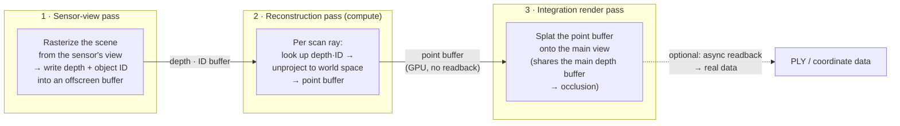

# LiDAR-mimic

**English** · [한국어](README.ko.md)

🔗 **Live demo:** [wonhotoss.github.io/LiDAR-mimic](https://wonhotoss.github.io/LiDAR-mimic/) — needs a WebGPU-capable browser (recent Chrome/Edge).

https://github.com/user-attachments/assets/2b1bf726-20d3-43e3-9b7a-c31da47b60f8

A program structure for producing **LiDAR-point-cloud-style visuals** from an ordinary 3D renderer.

The core idea is simple. To obtain the point cloud we do **not** trace rays one by one (raycast).
Instead we **rasterize the scene once from the sensor's viewpoint**, and each ray of the scan pattern
reads back the result (the depth buffer) to reconstruct a point. Reconstruction and rendering both happen
entirely on the GPU, with no readback to the CPU.

This document is platform-independent. It describes the behavior in render-pipeline terms rather than in
any specific engine/API vocabulary. For the Unity implementation and usage, see
[unity/README.md](unity/README.md).

This project is written for visual staging in real production environments; it proves its practicality
through applications of the idea on widely-used platforms, each with a live demo.

---

## What it does

- Takes a 3D scene as input (an ordinary scene of meshes, skinned meshes, and animated objects).
- Given the sensor's (= LiDAR's) position, orientation, and scan pattern, produces the points where the
  rays land on scene surfaces.
- Renders those points on top of the main view so they look like a real LiDAR scan.
- Keeps the whole process real-time (dense points · high resolution · interactive fps).

In other words, the primary goal is not "producing real point-cloud data" but **a point-cloud-like visual**.
That said, when needed, the same pipeline can also extract real coordinate data (see *readback* below).

---

## Why rasterization instead of raycasting

First, terminology. It is tempting to call this a "fast raycast," but strictly it is not raycasting.
Instead of intersecting (traversing) rays against scene geometry, **each scan ray looks up the result of a
rasterization done from the sensor's viewpoint**. The output (where a ray meets a surface) is identical to
raycasting, but the path to get it differs. In academia/industry this approach is usually called
**"raster-based LiDAR (simulation)" / "rasterization-based LiDAR"**, or **"reverse rasterization" ·
"depth-buffer LiDAR"**. (As an internal codename it is sometimes called *"deferred raycasting"* because of
its structural similarity to deferred shading, but that is not an established term.) For related prior work,
see [Prior work / related art](#prior-work--related-art) below.

The two approaches have fundamentally different cost structures.

| | True raycast (BVH etc.) | Raster-based scan (this project) |
|---|---|---|
| Visibility (occlusion) | descends an acceleration structure per ray · `O(log P)` | resolved once by the raster pass (hardware depth test); each ray just reads the result · `O(1)` |
| Adding scan rays | per-ray traversal cost accumulates | only the cost of looking up an already-built buffer — nearly free |
| Bone animation / mesh deformation | acceleration structure must be refit/rebuilt every frame | skinned as usual in the vertex shader — no extra cost |
| State to maintain | an acceleration structure kept in sync with the scene | none (redrawn every frame) |

To summarize, what makes rasterization win is not "parallelism" (both approaches parallelize). The essential
advantages are: **① visibility is solved once and shared by all rays**, **② the per-ray critical path is
`O(1)`**, **③ it uses fixed-function rasterizer/depth-test hardware directly**, and **④ there is no
persistent data structure to keep in sync under animation**.

These advantages matter most when there are **many rays (high density), objects move or deform, and a single
forward field of view suffices**. Conversely, when rays number only in the hundreds, or 360°/spherical
coverage is required, or quantization-free physical accuracy is the goal, true (GPU) raycasting is a better
fit.

---

## Pipeline overview

Rendering is split into three logical passes.

### 1. Sensor-view pass (depth prepass)

The sensor is just a camera (with a position, orientation, and FoV). From this viewpoint the scene is
rasterized into an offscreen buffer. Two values are written per pixel:

- **Depth** — the distance to the nearest surface in that direction (in normalized-device depth).
- **Object ID** — which object that surface came from.

The nearest surface is decided by the hardware depth test. So this single raster **resolves the visibility
of all scan rays at once**. All opaque objects in the scene are drawn, so even objects that will not become
points still act as occluders.

### 2. Reconstruction pass (GPU compute)

The scan pattern is the set of "rays leaving the sensor," represented as an array of 2D coordinates in the
sensor's projection space (normalized XY). For each ray, the compute pass:

1. Converts the ray's projection XY into a texel coordinate in the offscreen buffer and **looks up depth and
   ID** (point sample, no interpolation — to avoid silhouette contamination).
2. **Unprojects** (XY, looked-up depth) through the inverse view-projection into **world space**.
3. Writes `{ world position, object ID }` into the **point buffer**.

That result is the point cloud. If a ray met no surface, the background ID (0) remains and is filtered out
automatically later. The buffer never comes down to the CPU — it stays on the GPU.

### 3. Integration render pass

The main camera first rasterizes ordinary objects as usual (solid). It then reads the point buffer and draws
each point as a **fixed screen-size square splat**. During this:

- It **shares the main depth buffer**. So occlusion of points by ordinary objects, and self-occlusion among
  points, are handled naturally by the hardware depth test.
- Each point is checked against the set of objects to be drawn as points (the ID list of point-cloud
  objects); points not in the list are discarded as degenerate. Because this decision is made at draw time,
  **toggling an object between solid and points is instant with no recomputation**.
- Splat color/size can be given per object ID (per-object style) or driven by distance from the sensor via a
  colormap (depth colormap).

Because there is no readback, passes 1·2·3 can rerun every frame — object movement and bone animation are
reflected directly.

---

## Advantages of this structure

- **Practically decoupled from scene complexity.** Point-generation cost depends on the number of scan rays
  and the offscreen buffer resolution, and is separate from the scene's polygon count (aside from the
  ordinary cost of the raster itself). You get a dense point cloud in real time.
- **A readback-free, GPU-complete path.** Everything from generation to rendering finishes on the GPU. No CPU
  bandwidth or memory round-trips.
- **Natural occlusion.** Inter-object occlusion and self-occlusion are both handled by the depth test.
  Ordinary-rendered objects and point-rendered objects correctly occlude each other in one scene.
- **Real-time adjustment.** The sensor's position/orientation/FoV and the scan pattern's density/shape can be
  changed at runtime. When the pattern changes, only the ray buffer needs refilling.
- **Per-object differentiation.** You can control per object whether it renders as solid / points / both, and
  how each object's point color and size are set.
- **Optional real data.** The goal is visual, but the same point buffer can be read back (asynchronously,
  out-of-band) and exported as real coordinate + ID data. This path is separate from the real-time render
  path, so it does not affect fps.

---

## Limitations and characteristics

- **Single perspective FoV (<180°).** The premise of the `O(1)` lookup is that scan rays lie on a single
  projection grid. Because of this, a 360°/spinning LiDAR cannot be represented directly by this structure
  (it would need multiple sensors or a separate design).
- **Depth quantization.** If the offscreen buffer resolution is low relative to the ray density, several rays
  sample the same texel and point placement becomes stair-step quantized. Keeping the buffer resolution at or
  above the ray density resolves this.
- **Silhouette flying pixels.** At object boundaries, a ray may produce a point that "flies" between the
  front and back surfaces. This is an artifact present in real LiDAR too, so it can be accepted as authentic.
- **Temporal shimmer.** Because rays are fixed in the sensor's projection space, points can appear to crawl
  over surfaces when objects or the sensor move (physically correct for a stationary sensor's view, but it
  may be visually distracting).

---

## Prior work / related art

The **core idea (sensor-view raster → depth/ID buffer → point reconstruction) is not new.** It is already
well established under the name "raster-based LiDAR," and several implementations with nearly the same
skeleton exist. Below are the closest precedents surveyed for this project.

### Raster-based LiDAR / sensor simulation (closest precedents)

- **GPU Rasterization-Based 3D LiDAR Simulation for Deep Learning** — Denis, Royen, Bolsée, Vercheval,
  Pižurica, Munteanu (VUB / Ghent Univ.), *Sensors (MDPI)* 2023, 23(19):8130.
  Uses the GPU raster pipeline "in reverse," sampling output textures with the LiDAR's uv coordinates to
  mimic the scan pattern. Essentially the same skeleton as this project's sensor-view pass + compute
  reconstruction — **the closest reference.**
  [MDPI](https://www.mdpi.com/1424-8220/23/19/8130) · [PMC](https://pmc.ncbi.nlm.nih.gov/articles/PMC10574882/) · DOI 10.3390/s23198130
- **GLIDAR: An OpenGL-based, Real-Time, and Open Source 3D Sensor Simulator** — Woods & Christian,
  *Journal of Imaging (MDPI)* 2016, 2(1):5.
  An OpenGL fragment shader extracts values from the depth buffer and unprojects to reconstruct points. It
  overlaps down to the details: it **stores depth in the color channels** and **turns AA/bilinear off** for
  the same reasons this project chose an `RGFloat` buffer + point `Load` + no AA.
  [MDPI](https://www.mdpi.com/2313-433X/2/1/5)
- **Physical LiDAR Simulation in Real-Time Engine** — Jansen, Huebel, Steckel, *IEEE Sensors* 2022.
  A virtual render camera + a post-process shader built on **the engine's G-Buffer depth pass** (an example
  showing the "deferred" structure is already used in this family).
  [arXiv:2208.10295](https://arxiv.org/abs/2208.10295)

### Fast point-cloud rendering (relevant to the integration draw)

- **Rendering Point Clouds with Compute Shaders** — Schütz & Wimmer (TU Wien), *SIGGRAPH Asia* 2019.
  A compute rasterizer that encodes depth+color into a single buffer via `atomicMin`, more than 10× faster
  than the classic `GL_POINTS`. A reference for point-splat / compaction optimization.
  [arXiv:1908.02681](https://arxiv.org/abs/1908.02681) · [repo](https://github.com/m-schuetz/compute_rasterizer)

### Contrast: raytracing-based LiDAR

Physically more accurate (multi-bounce, exact incidence angle, etc.), but it needs an acceleration structure
to maintain and CPU readback, making it heavier and less configurable. This is the direction this project
**deliberately avoided.** A representative example is the NVIDIA OptiX-based LiDAR model toolbox family (e.g.
*LiMOX*, *Sensors* 2024). Unity's official docs also split LiDAR into **raster-based** and
**raytracing-based**.

### What sets this project apart

Most prior work aims to be a **sensor-data generator** (reading back to extract training data / simulation
results). This project recombines the same skeleton for a different purpose.

- **Readback-free real-time visualization** — reconstructed points are drawn directly as splats on the GPU
  (a visual, not data extraction).
- **Occlusion integrated with normal rendering** — points are drawn into the main depth buffer so
  solid↔point occlusion is handled by hardware.
- **Per-object ID rasterized alongside depth** — used for per-point styling (color · size · mode).

In short, the distinctive part is applying a known technique (raster-based LiDAR) in a
**readback-free · occlusion-integrated · real-time-rendering** combination and purpose. It does not claim a
new fundamental technique.

> The titles/authors/years/sources of the citations above were verified, but the detailed claims of each
> paper should be re-confirmed against the originals before citing.

## Related documents

- [unity/README.md](unity/README.md) — Unity implementation and usage.
