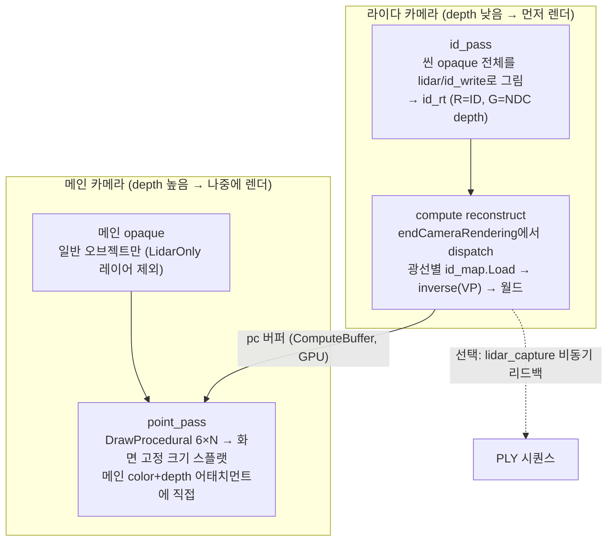

# LiDAR-mimic — Unity 구현

[English](README.md) · **한국어**

🔗 **라이브 데모:** [wonhotoss.github.io/LiDAR-mimic/unity](https://wonhotoss.github.io/LiDAR-mimic/unity/) — WebGPU 지원 브라우저(최신 Chrome/Edge) 필요.

루트 [README.ko.md](../README.ko.md)의 플랫폼 독립적 아이디어를 **Unity 6 / URP 17 / RenderGraph**에서
구현한 것이다. 이 문서는 (1) 아이디어가 Unity의 어떤 기능으로 매핑되는지, (2) 런타임에 무엇을
조작할 수 있는지를 다룬다. (씬 배선은 코드/컴포넌트의 일부이므로 각 필드의 인스펙터 도움말과 코드 주석으로 기술한다.)

- 환경: **Unity 6000.4.10**, **URP 17.4.0**, RenderGraph API, Input System 패키지.
- 테스트 환경: **Windows + 데스크탑 Chrome (WebGPU)**.
- URP 설정: RequireDepthTexture / RequireOpaqueTexture on, DepthPriming off, MSAA off, Forward+.
- 코드: [Assets/Scripts/Lidar/](Assets/Scripts/Lidar/), UI: [Assets/UI/](Assets/UI/).

---

## 1. 아이디어 → Unity 매핑

| 개념(루트 README) | Unity 구현 |
|---|---|
| 센서 = 카메라 | `lidar` 컴포넌트가 붙은 전용 Camera. 자기 `RenderTexture`(`id_rt`)에 렌더. |
| 센서 시점 패스 (깊이+ID 선획득) | `lidar_render_feature`의 `id_pass`. override 머티리얼 `lidar/id_write`로 씬을 그려 R=ID, G=NDC depth 기록. |
| 오프스크린 버퍼 | `id_rt` — **RGFloat** RenderTexture (R=ID 실수, G=32bit NDC depth). 화면 해상도와 독립(`map_resolution`, 기본 1024²). |
| 복원 패스 (compute) | `lidar_reconstruct.compute`. 라이다 카메라 렌더 직후 `RenderPipelineManager.endCameraRendering`에서 dispatch. |
| 포인트 버퍼 | `ComputeBuffer<pc_point>` (`pc_point = { float3 world; uint id }`). 리드백 없음. |
| 통합 렌더 패스 | `lidar_render_feature`의 `point_pass`. 메인 카메라에서 `DrawProcedural`(6×N 삼각형)로 스플랫. 셰이더 `lidar/point`. |
| 오브젝트 ID | `lidar_receiver` 컴포넌트가 있으면 부여. `lidar_receiver_registry`가 enable 시 1 이상의 작은 순차 정수를 자동 발급. ID 0 = 배경/비수신자. |

### 패스 순서

하나의 `ScriptableRendererFeature`(`lidar_render_feature`)가 카메라에 따라 분기한다.

1. **라이다 카메라** — `id_pass`만 큐잉. `AfterRenderingOpaques`에서 씬 opaque 전체를 override 머티리얼로
   그려 `id_rt`에 ID+깊이를 기록. `lidar/id_write`는 `ZWrite Off / ZTest LEqual`로, 카메라 opaque 패스가
   써둔 깊이 위에 겹쳐 그려 최근접 표면의 ID만 남긴다. ID는 렌더러의 `MaterialPropertyBlock`(`_LidarID`)에서 읽는다.
2. **복원(compute)** — `id_rt`가 채워진 직후 RenderGraph 밖에서 dispatch. 광선마다 `id_map.Load`(point 샘플)로
   ID·깊이를 읽고, `inverse(VP)`(= `GL.GetGPUProjectionMatrix(proj, false) * worldToCamera`의 역행렬)로
   월드 좌표를 복원해 `pc` 버퍼에 기록. `renderIntoTexture`는 **false**여야 한다(true면 Y가 뒤집혀 상하 반전).
3. **메인 카메라 opaque** — URP 기본. 일반 오브젝트만(레이어 필터로 pc-only 오브젝트는 제외).
4. **통합 드로우** — `AfterRenderingOpaques`. `pc` 버퍼를 읽어 화면 고정 크기 축정렬 사각형으로 스플랫.
   메인 color+depth 어태치먼트에 직접 그린다. depth read/write on → 차폐가 하드웨어 깊이 테스트로 처리.

라이다 카메라와 메인 카메라의 실행 순서는 **카메라 `depth` 값**으로 보장한다(라이다 카메라 depth < 메인 카메라 depth).

---

## 2. 오브젝트 모드

오브젝트를 포인트클라우드 소스로 만들려면 [Assets/Scripts/Lidar/lidar_receiver.cs](Assets/Scripts/Lidar/lidar_receiver.cs)
컴포넌트를 붙인다. 컴포넌트가 없는 오브젝트는 일반 렌더만 되는 normal-only이며, 라이다 패스에서는 ID 0
차폐물로만 취급된다.

`receiver_mode`는 세 가지이고, 각각은 **(레이어, `_LidarID`)** 조합으로 구현된다 — 씬/프리팹/카메라를
다시 배선하지 않고 레이어 이동 + MPB 값만 바꾼다.

| 모드 | 레이어 | `_LidarID` | 메인 화면 | 결과 |
|---|---|---|---|---|
| `pc_only` | `LidarOnly` | id | 숨김(cullingMask 제외) | **포인트로만** 표시 |
| `both` | 원래 레이어 | id | solid | solid + 포인트 동시(겹침은 depth bias로 완화) |
| `solid` | 원래 레이어 | 0 | solid | 일반 렌더만, 차폐는 하되 **포인트 없음** |

- **active 토글** — `lidar_receiver.active`는 `Renderer.enabled`를 켜고 끈다(`GameObject.SetActive`가 아님).
  끄면 모든 카메라에서 빠져 solid·차폐·포인트가 모두 사라지지만, 레지스트리 등록과 모드 상태는 유지되어
  다시 켜면 그대로 복원된다.
- 모든 receiver는 시작 시 `pc_only`로 초기화된다.

---

## 3. 스캔 패턴

[Assets/Scripts/Lidar/lidar.cs](Assets/Scripts/Lidar/lidar.cs)의 `generate()`가 광선의 프로젝션 XY 배열을 만든다.
**동심원 패턴**이며, 각 링의 포인트 수를 링의 면적(≈2r+1)에 비례시켜 **중심이 몰리지 않고 밀도가 균일**하도록 한다.
포인트 총수는 항상 `ring_count × points_per_ring`과 정확히 일치한다(버퍼 할당과 dispatch가 이 수에 의존).

`generate()`는 **단일 소스**다. 실제 스캔에 올리는 GPU 버퍼도, UI의 패턴 프리뷰 이미지도 같은 배열에서 그린다.

패턴 파라미터가 바뀌면 `lidar.rebuild()`가 광선 버퍼를 다시 채우고(포인트 수가 바뀌면 재할당) 프리뷰를 갱신한다.
에디터 플레이 중에는 `OnValidate`가 자동 호출된다. 파라미터는 `OnValidate`에서 **≥1로 clamp**된다(0/음수 버퍼 예외 방지).

---

## 4. 포인트 렌더 모드

전역 렌더 모드는 `point_render_mode` 두 가지이며 런타임에 전환한다(`lidar.render_mode`, 기본값 `depth_map`).

- **`per_object`** — 오브젝트(ID)별 색과 크기로 그린다. 색·크기는 각 `lidar_receiver`의 값에서 per-ID 스타일 버퍼로 모아 셰이더에 전달.
- **`depth_map`** — 센서로부터의 거리로 컬러맵을 입힌다. 포인트 크기는 전역 고정값. 정점 셰이더에서
  `distance(world, lidar_pos)`를 `[depth_min, depth_max]`로 정규화해 컬러맵 텍스처를 샘플한다.

`depth_map` 관련 전역값은 **렌더 피처(`PC_Renderer` 상의 `lidar_render_feature`)에서 에디터 전용으로** 편집한다
(런타임 UI에는 모드 토글만 있다):

| 필드 | 기본값 | 효과 |
|---|---|---|
| `global_point_size` | 4 | depth_map 모드의 포인트 크기(px) |
| `depth_colormap` | jet 유사(근=파랑→원=빨강) | 거리→색 그라디언트 |
| `depth_min` / `depth_max` | 0 / 50 | 컬러맵 양 끝에 매핑되는 거리(m) |
| `depth_emission` | 1 | 컬러맵 색에 곱하는 값. >1이면 Bloom을 먹여 발광 |
| `depth_bias` | 0.0002 | 클립 z를 카메라 쪽으로 미세 이동(both 모드 coplanar z-fighting 완화). **부호는 플랫폼 의존** — 포인트가 자기 표면에 가려지면 부호를 뒤집는다 |

컬러맵은 256×1 룩업 텍스처로 baked되어 셰이더가 샘플한다.

---

## 5. 런타임 컨트롤 패널

모든 조작은 런타임 UI Toolkit 패널 하나로 통합되어 있어 **스탠드얼론 빌드에서도** 전 기능을 쓸 수 있다.
([Assets/Scripts/Lidar/lidar_control_panel.cs](Assets/Scripts/Lidar/lidar_control_panel.cs),
[Assets/UI/lidar_control_panel.uxml](Assets/UI/lidar_control_panel.uxml) / `.uss`)

접이식 섹션 순서: **Point Rendering → Receivers → Pattern → Recording → Debug.**

### Point Rendering
- `per-object` / `depth-map` 버튼 — 전역 포인트 렌더 모드 전환. 현재 모드가 하이라이트된다.

### Receivers
- **All** 행 — `pc-only` / `both` / `solid`로 모든 receiver를 한 번에 전환.
- **오브젝트별 행** — 오브젝트 이름 + on/off active 버튼(켜짐=녹색; 꺼지면 모드 버튼 비활성) + `pc-only`/`both`/`solid` 모드 버튼.
- **행에 마우스를 올리면** 해당 오브젝트 위치에 이름 마커가 3D로 표시된다(카메라 뒤면 숨김). 마커는 씬 클릭을 가로채지 않는다.
- **per-object 모드일 때만** 각 행에 색 편집기가 나타난다: 색 스와치 + `Emission` 슬라이더(1–8).
  스와치를 클릭하면 R/G/B 팝업 피커가 열린다. 색은 `base RGB × Emission`(HDR)이며 >1이면 Bloom으로 발광한다.
  (UI Toolkit `ColorField`는 에디터 전용이라 런타임은 스와치+슬라이더로 HDR 색을 구성.)

### Pattern
`lidar` 디바이스에 라이브 바인딩. 값 변경 → `rebuild()` → 프리뷰 갱신.

| 컨트롤 | 범위 | 대상 |
|---|---|---|
| `Rings` | 1–128 | `ring_count` — 동심원 링 수 |
| `Points / ring` | 1–256 | `points_per_ring` — 링당 평균 포인트 수(총수 = Rings×이 값) |
| `Radius` | 0–1 | `radius` — 최외곽 링의 NDC 반경(≤1) |
| `Angle offset` | 0–1 | `ring_angle_offset` — 링마다 더해지는 각도(라디안), 링이 방사상으로 정렬되지 않게 함 |
| `pattern_preview` | — | 검은 배경 · 흰 점으로 그린 스캔 패턴 프리뷰 |

### Recording
포인트 버퍼를 **비동기 GPU 리드백**으로 스냅샷해 프레임당 하나의 **바이너리 PLY**(x/y/z float + id uint)로 저장한다.
([Assets/Scripts/Lidar/lidar_capture.cs](Assets/Scripts/Lidar/lidar_capture.cs)) 캡처는 벽시계 기준으로 스로틀되어 앱 fps에 영향을 주지 않는다.

| 컨트롤 | 대상 | 효과 |
|---|---|---|
| `Prefix` | `prefix` | 출력 파일명 접두어(`{prefix}_{000000}.ply`) |
| `Capture FPS` | `capture_fps` | 초당 최대 캡처 수(≤0이면 렌더 프레임마다) |
| `Drop id==0` | `filter` | 미교차/배경 포인트 제거(끄면 오프라인 필터용 raw 덤프) |
| `OpenGL coords` | `opengl` | 켜면 z 부호를 뒤집어 우수좌표계(OpenGL)로 저장. 끄면 Unity 원시 월드 좌표 |
| `Output dir` | `output_dir` | 출력 폴더(빈 값 = `Application.persistentDataPath`) |
| `Browse…` | — | 네이티브 폴더 선택 대화상자(UnityStandaloneFileBrowser) |
| `Start/Stop Recording` | `recording` | 캡처 토글 |
| status | — | 녹화 상태 + 캡처된 프레임 수 |

### Debug (LiDAR view)
라이다 `id_rt`를 `lidar/id_debug` 머티리얼로 blit한 텍스처를 이미지로 표시한다(센서 시점의 ID/깊이 확인용).

---

## 6. 실시간에 무엇이 반영되는가

- **센서 이동/회전/FoV** — 매 프레임 카메라 행렬로 즉시 반영.
- **오브젝트 이동 / 본 애니메이션** — 센서 시점 패스·복원이 매 프레임 재실행되므로 즉시 반영.
- **스캔 패턴 변경** — `rebuild()`로 광선 버퍼 재생성.
- **일반↔포인트 토글** — 통합 드로우 시점 판정이라 재계산 없이 즉시.
- **오브젝트 색/크기** — per-ID 스타일 버퍼가 매 프레임 갱신.

`map_resolution`(id_rt 해상도)만은 런타임 변경 미지원(재생성 필요) — 현재 패턴 파라미터만 라이브다.

---

## 7. 눈으로 확인하는 요소 (요약)

직접 보면 알 수 있는 시각 요소는 다음과 같이 정리된다.

- **포인트 색** — per-object 모드: 오브젝트별 지정 색(HDR, Emission↑ 시 발광). depth-map 모드: 거리 컬러맵(기본 근거리=파랑 → 원거리=빨강).
- **포인트 크기** — 카메라 거리와 무관하게 화면 고정 크기 사각형. per-object 모드는 오브젝트별, depth-map 모드는 전역 고정.
- **패턴 프리뷰** — Pattern 섹션의 검은 배경 · 흰 점 이미지가 실제 스캔 광선 분포와 동일.
- **호버 마커** — Receivers 행에 마우스를 올리면 해당 오브젝트에 노란 테두리 이름 박스.
- **Debug 뷰** — 센서 시점의 ID/깊이 맵.

---

## 관련 문서

- [../README.ko.md](../README.ko.md) — 플랫폼 독립적 핵심 아이디어.
