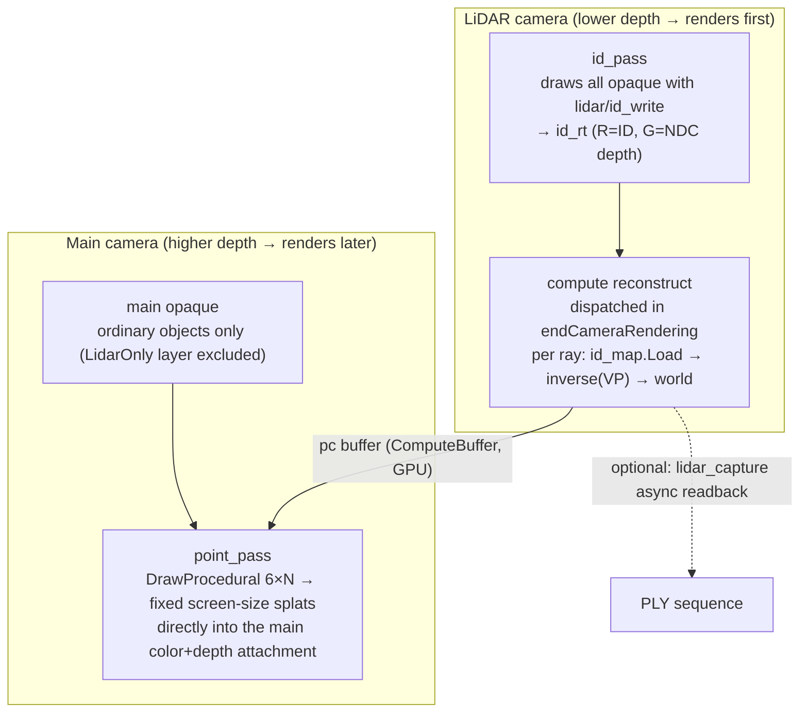

# LiDAR-mimic — Unity implementation

**English** · [한국어](README.ko.md)

🔗 **Live demo:** [wonhotoss.github.io/LiDAR-mimic/unity](https://wonhotoss.github.io/LiDAR-mimic/unity/) — needs a WebGPU-capable browser (recent Chrome/Edge).

This is a **Unity 6 / URP 17 / RenderGraph** implementation of the platform-independent idea in the root
[README.md](../README.md). This document covers (1) how the idea maps to Unity features, and (2) what can be
controlled at runtime. (Scene wiring is part of the code/components, so it is described via each field's
inspector help and code comments.)

- Environment: **Unity 6000.4.10**, **URP 17.4.0**, RenderGraph API, Input System package.
- Tested on: **Windows + desktop Chrome (WebGPU)**.
- URP settings: RequireDepthTexture / RequireOpaqueTexture on, DepthPriming off, MSAA off, Forward+.
- Code: [Assets/Scripts/Lidar/](Assets/Scripts/Lidar/), UI: [Assets/UI/](Assets/UI/).

---

## 1. Idea → Unity mapping

| Concept (root README) | Unity implementation |
|---|---|
| Sensor = camera | A dedicated Camera with the `lidar` component. Renders into its own `RenderTexture` (`id_rt`). |
| Sensor-view pass (depth+ID prepass) | The `id_pass` in `lidar_render_feature`. Draws the scene with the override material `lidar/id_write`, writing R=ID, G=NDC depth. |
| Offscreen buffer | `id_rt` — an **RGFloat** RenderTexture (R=ID as float, G=32-bit NDC depth). Independent of screen resolution (`map_resolution`, default 1024²). |
| Reconstruction pass (compute) | `lidar_reconstruct.compute`. Dispatched right after the LiDAR camera renders, via `RenderPipelineManager.endCameraRendering`. |
| Point buffer | `ComputeBuffer<pc_point>` (`pc_point = { float3 world; uint id }`). No readback. |
| Integration render pass | The `point_pass` in `lidar_render_feature`. Splats via `DrawProcedural` (6×N triangles) on the main camera. Shader `lidar/point`. |
| Object ID | Assigned if the `lidar_receiver` component is present. `lidar_receiver_registry` auto-issues a small sequential integer ≥ 1 on enable. ID 0 = background / non-receiver. |

### Pass order

A single `ScriptableRendererFeature` (`lidar_render_feature`) branches by camera.

1. **LiDAR camera** — enqueues only `id_pass`. At `AfterRenderingOpaques` it draws all scene opaque with the
   override material into `id_rt`, writing ID+depth. `lidar/id_write` uses `ZWrite Off / ZTest LEqual`,
   overlaying on the depth the camera's opaque pass already wrote so only the nearest surface's ID remains.
   The ID is read from the renderer's `MaterialPropertyBlock` (`_LidarID`).
2. **Reconstruction (compute)** — dispatched outside RenderGraph right after `id_rt` is filled. Per ray, it
   reads ID·depth via `id_map.Load` (point sample) and reconstructs world space with `inverse(VP)`
   (= the inverse of `GL.GetGPUProjectionMatrix(proj, false) * worldToCamera`), writing into the `pc` buffer.
   `renderIntoTexture` must be **false** (true flips Y and inverts the reconstruction vertically).
3. **Main camera opaque** — URP default. Ordinary objects only (a layer filter excludes pc-only objects).
4. **Integration draw** — `AfterRenderingOpaques`. Reads the `pc` buffer and splats fixed screen-size,
   axis-aligned squares directly into the main color+depth attachment. Depth read/write on → occlusion
   handled by the hardware depth test.

The execution order of the LiDAR and main cameras is guaranteed by the **camera `depth` value** (LiDAR camera
depth < main camera depth).

---

## 2. Object modes

To make an object a point-cloud source, add the
[Assets/Scripts/Lidar/lidar_receiver.cs](Assets/Scripts/Lidar/lidar_receiver.cs) component. Objects without it
are normal-only (ordinary render), treated as ID-0 occluders in the LiDAR pass.

`receiver_mode` has three values, each implemented as a **(layer, `_LidarID`)** combination — it only moves
the object's layer and sets the MPB value, without re-wiring the scene/prefab/camera.

| Mode | Layer | `_LidarID` | Main view | Result |
|---|---|---|---|---|
| `pc_only` | `LidarOnly` | id | hidden (excluded from cullingMask) | shown **as points only** |
| `both` | original layer | id | solid | solid + points together (overlap eased by depth bias) |
| `solid` | original layer | 0 | solid | ordinary render only, occludes but **no points** |

- **Active toggle** — `lidar_receiver.active` toggles `Renderer.enabled` (not `GameObject.SetActive`).
  Turning it off removes the object from every camera so solid·occlusion·points all disappear, but registry
  registration and mode state are kept, so turning it back on restores everything.
- Every receiver starts as `pc_only`.

---

## 3. Scan pattern

`generate()` in [Assets/Scripts/Lidar/lidar.cs](Assets/Scripts/Lidar/lidar.cs) builds the array of ray
projection XY. It is a **concentric-ring pattern** where each ring's point count is proportional to the ring's
area (≈2r+1), so density is **uniform rather than crowding the center**. The total point count always equals
exactly `ring_count × points_per_ring` (buffer allocation and dispatch depend on this).

`generate()` is the **single source**: both the GPU buffer used for the actual scan and the UI's pattern
preview image are drawn from the same array.

When a pattern parameter changes, `lidar.rebuild()` refills the ray buffer (reallocating if the point count
changed) and refreshes the preview. During editor play, `OnValidate` is called automatically. Parameters are
**clamped to ≥1** in `OnValidate` (to avoid zero/negative-length buffer exceptions).

---

## 4. Point render modes

The global render mode is one of two `point_render_mode` values, switchable at runtime (`lidar.render_mode`,
default `depth_map`).

- **`per_object`** — draws with each object's (ID's) color and size. Colors/sizes are gathered from each
  `lidar_receiver` into a per-ID style buffer and passed to the shader.
- **`depth_map`** — applies a colormap by distance from the sensor. Point size is a global constant. In the
  vertex shader, `distance(world, lidar_pos)` is normalized to `[depth_min, depth_max]`, offset by a
  time-driven phase, and used to sample the colormap texture: `frac(t + depth_offset)`.

The `depth_map` globals are edited **on the render feature (`lidar_render_feature` on `PC_Renderer`),
editor-only** (the runtime UI only has the mode toggle):

| Field | Default | Effect |
|---|---|---|
| `global_point_size` | 4 | point size (px) in depth_map mode |
| `depth_colormap` | jet-like (blue → red → back to blue) | distance→color gradient. Sampled cyclically, so end it on the start color |
| `depth_min` / `depth_max` | 0 / 50 | distances (m) mapped to the colormap ends |
| `depth_emission` | 1 | multiplier on the colormap color; >1 feeds Bloom (glow) |
| `depth_scroll_speed` | 0.1 | colormap scroll in cycles/sec (negative reverses); 0 = static |
| `depth_bias` | 0.0002 | small clip-z nudge toward the camera (eases coplanar z-fighting in `both` mode). **Sign is platform-dependent** — flip it if points are hidden by their own surface |

The colormap is baked into a 256×1 lookup texture and sampled by the shader. The bake is periodic (texel `i`
= gradient at `i/256`, `Repeat` wrap), so the ramp filters seamlessly across the wrap point as it scrolls.

---

## 5. Runtime control panel

All controls are consolidated into one runtime UI Toolkit panel, so the full feature set works **even in a
standalone build**.
([Assets/Scripts/Lidar/lidar_control_panel.cs](Assets/Scripts/Lidar/lidar_control_panel.cs),
[Assets/UI/lidar_control_panel.uxml](Assets/UI/lidar_control_panel.uxml) / `.uss`)

Foldout section order: **Point Rendering → Receivers → Pattern → Recording → Debug.**

### Point Rendering
- `per-object` / `depth-map` buttons — switch the global point render mode. The current mode is highlighted.

### Receivers
- **All** row — switch every receiver at once to `pc-only` / `both` / `solid`.
- **Per-object row** — object name + an on/off active button (green when on; mode buttons disable when off) +
  `pc-only`/`both`/`solid` mode buttons.
- **Hovering a row** overlays a name marker in 3D at that object's position (hidden when behind the camera).
  The marker never intercepts scene clicks.
- **Only in per-object mode**, each row shows a color editor: a color swatch + an `Emission` slider (1–8).
  Clicking the swatch opens an R/G/B popup picker. The color is `base RGB × Emission` (HDR); >1 glows via
  Bloom. (UI Toolkit's `ColorField` is editor-only, so runtime composes the HDR color from swatch + sliders.)

### Pattern
Live-bound to the `lidar` device. A value change → `rebuild()` → preview refresh.

| Control | Range | Target |
|---|---|---|
| `Rings` | 1–128 | `ring_count` — number of concentric rings |
| `Points / ring` | 1–256 | `points_per_ring` — average points per ring (total = Rings × this) |
| `Radius` | 0–1 | `radius` — NDC radius of the outermost ring (≤1) |
| `Angle offset` | 0–1 | `ring_angle_offset` — radians added per ring so rings don't align radially |
| `pattern_preview` | — | scan-pattern preview drawn as white points on black |

### Recording
Snapshots the point buffer via **async GPU readback** and saves one **binary PLY** (x/y/z float + id uint)
per frame.
([Assets/Scripts/Lidar/lidar_capture.cs](Assets/Scripts/Lidar/lidar_capture.cs)) Capture is throttled by
wall-clock time so it does not affect app fps.

| Control | Target | Effect |
|---|---|---|
| `Prefix` | `prefix` | output filename prefix (`{prefix}_{000000}.ply`) |
| `Capture FPS` | `capture_fps` | max captures per second (≤0 = every rendered frame) |
| `Drop id==0` | `filter` | drop no-hit/background points (off = raw dump for offline filtering) |
| `OpenGL coords` | `opengl` | on: flip z sign to save right-handed (OpenGL); off: raw Unity world coords |
| `Output dir` | `output_dir` | output folder (empty = `Application.persistentDataPath`) |
| `Browse…` | — | native folder-picker dialog (UnityStandaloneFileBrowser) |
| `Start/Stop Recording` | `recording` | toggle capture |
| status | — | recording state + number of captured frames |

### Debug (LiDAR view)
Shows a texture that blits the LiDAR `id_rt` through the `lidar/id_debug` material (to inspect the sensor-view
ID/depth).

---

## 6. What updates in real time

- **Sensor move/rotate/FoV** — reflected instantly via the camera matrices each frame.
- **Object movement / bone animation** — instant, because the sensor-view pass and reconstruction rerun every
  frame.
- **Scan pattern change** — ray buffer regenerated via `rebuild()`.
- **Solid↔points toggle** — instant, decided at integration-draw time (no recomputation).
- **Object color/size** — the per-ID style buffer is refreshed every frame.

Only `map_resolution` (id_rt resolution) is not runtime-changeable (it needs id_rt recreation) — currently
only the pattern parameters are live.

---

## 7. Things you can tell at a glance (summary)

Visual elements you can recognize by looking:

- **Point color** — per-object mode: each object's assigned color (HDR, glows as Emission↑). depth-map mode:
  distance colormap (default near=blue → far=red).
- **Point size** — fixed screen-size squares regardless of camera distance. Per-object in per-object mode,
  global in depth-map mode.
- **Pattern preview** — the black-background / white-point image in the Pattern section matches the actual
  scan-ray distribution.
- **Hover marker** — hovering a Receivers row shows a yellow-bordered name box on that object.
- **Debug view** — the sensor-view ID/depth map.

---

## Related documents

- [../README.md](../README.md) — the platform-independent core idea.
